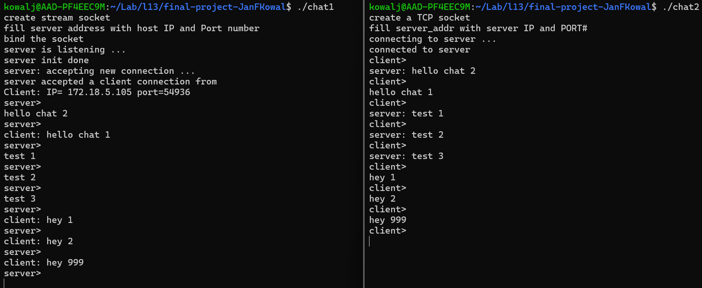

# L13 Systems Programming Final Project
Authors: Ryan Morgan, Jan Kowal
## Purpose and Function
We decided to make a chat program between 2 different command prompt terminals. To use the program you must get you server ip by running 'hostname -I' in the terminal and replacing the ip in chat2.c with the IP. Then run the make file to compile the program, run 
./chat1 to start the server, then finally run ./chat2 to start the clien. After this you should have 2 terminals connected to each other that are able to send or recieve a message at a given time.
## Implementation
We implemented this by using the UDP protocoll. This was accomplished by chat1 initializing a socket and binding it to a port. Which then would be connected to from the client program. Both programs implement 2 threads to handle waiting to read and waiting to write at the same time without being interupted.
## Sample Operation
